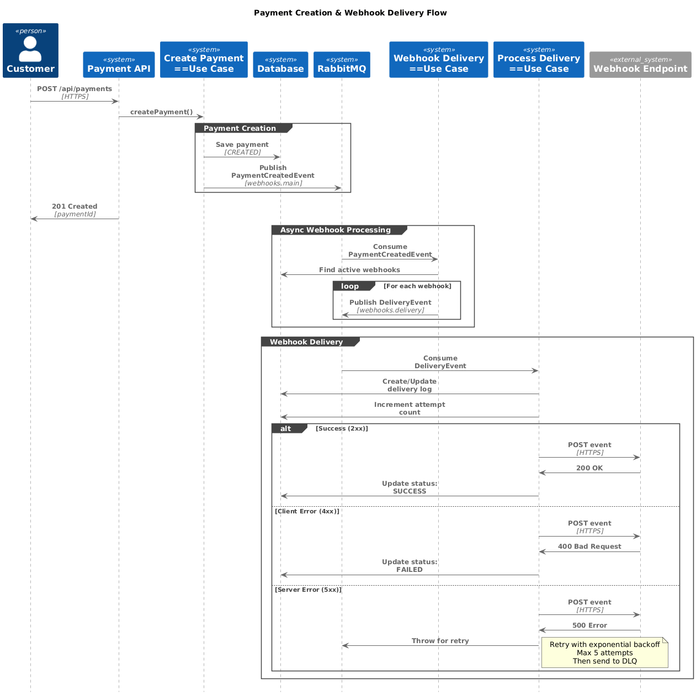

# Payment Application

A microservice for payment processing with webhook delivery system using hexagonal architecture.

## Tech Stack

- Java 21
- Spring Boot 3.5.8
- MySQL
- RabbitMQ
- Flyway
- MapStruct

## Requirements
    - Docker & Docker Compose
    - Java 21

## Quick Start

1. Start infrastructure:
```bash
docker-compose up -d
```

2. Run application:
```bash
./gradlew bootRun
```

3. Access:
- Application: http://localhost:8080
- Swagger UI: http://localhost:8080/swagger-ui.html
- Adminer (DB): http://localhost:8081
- RabbitMQ Management: http://localhost:15672 (guest/guest)

## Architecture

The application follows **Hexagonal Architecture** (Ports and Adapters) with event-driven design.


### Architecture Layers

```
Domain (Core Business Logic)
    ↑
Application (Use Cases & Ports)
    ↑
Infrastructure (Adapters: HTTP, DB, Messaging)
```

## Event Flow

### Payment Creation & Webhook Delivery




## Key Features

### Payment Processing
- RESTful API for payment creation
- Idempotency key validation
- Credit card encryption (AES-256-GCM)
- Event-driven architecture

### Webhook System
- Register webhook endpoints
- Automatic webhook delivery on payment events
- Retry mechanism with exponential backoff
- Dead Letter Queue (DLQ) for failed deliveries
- Delivery log tracking

### Retry Configuration
Configure retry behavior in `application.yaml`:
```yaml
spring:
  rabbitmq:
    listener:
      simple:
        retry:
          max-attempts: 5      # Max retry attempts
          initial-interval: 1000   # Initial delay (ms)
          multiplier: 2.0      # Backoff multiplier
          max-interval: 30000  # Max delay (ms)
```

## API Endpoints

### Payments
- `POST /api/payments` - Create payment
- Requires: firstName, lastName, zipCode, cardNumber
- Returns: Payment ID and status

### Webhooks
- `POST /api/webhooks` - Register webhook
- Requires: endpointUrl, eventType
- Returns: Webhook ID and configuration

## Infrastructure Services

**Running via Docker Compose:**
- MySQL (Port 3306)
- Adminer (Port 8081)
- RabbitMQ (Port 5672, Management 15672)
- HTTPBin (Port 80) - For webhook testing

## Testing

Run tests:
```bash
./gradlew test
```

## Database Migrations

Flyway migrations in `src/main/resources/db/migration/`:
- `V1__create_payment_table.sql`
- `V2__create_webhook_table.sql`
- `V3__create_webhook_delivery_log.sql`

## Environment Variables

Required:
```bash
APP_ENCRYPTION_KEY_BASE64=<base64-encoded-256-bit-key>
SPRING_DATASOURCE_URL=jdbc:mysql://localhost:3306/payment_db
SPRING_DATASOURCE_USERNAME=user
SPRING_DATASOURCE_PASSWORD=password
SPRING_RABBITMQ_HOST=localhost
```

## Project Structure

```
src/main/java/com/payment/app/
├── application/          # Use Cases & DTOs
│   ├── dto/
│   ├── mapper/
│   ├── port/
│   └── useCase/
├── domain/              # Business Logic
│   ├── model/
│   ├── type/
│   └── exceptions/
└── infrastructure/      # External Adapters
    ├── config/
    ├── controllers/
    ├── httpClient/
    ├── messaging/
    ├── persistence/
    └── util/
```

## License

MIT
